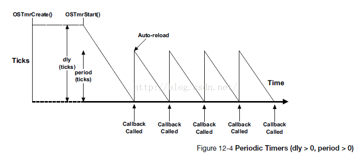
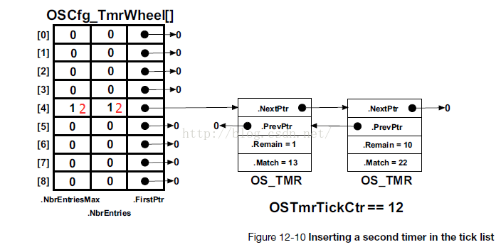
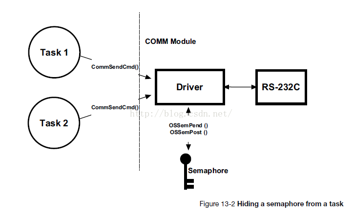

读uCOSIII源码笔记
===============================================
原创 2016年02月21日 18:31:59
https://blog.csdn.net/avenger0422/article/details/50708969
-----------------------------------------------

## 首先谈一下自己读RTOS的粗略认识吧

刚开始接触单片机时使用的都是while(true)，一个循环处理所有的任务。直到写了一个通过GPRS模块与上层服务通信（长连接）之后，才发现在while(true)中处理好恶心，老是掉线之后连接不上。可能是对AT指令的处理没有搞好，就开始各种找怎么解决，接触到了uC/OSIII，阅读了他提供的文档，阅读了源代码，慢慢看，感觉进步很多，用着用着就爱上了。
低复杂程度的系统通常是用foreground/background systems 或者super-loops，即while(true)。foreground为中断级别，background为任务级别。


uC/OS-III 是一个抢占式内核，一直处理准备好的最重要的任务。ISR通知或发送信息给高优先级的任务来处理，ISR结束后uC切换到高优先级的任务处理，处理完成之后，切换到低优先级任务处理。
uC/OS-III需要1K~4Kbytes的RAM，还需加上每个任务的堆栈地址。当使用real-time kernel设计了一个系统之后，基本不会使用while(true)，我就是一个典型的例子。


特别说明一下Hook（钩子函数）：一个允许用户扩展系统功能的函数。在钩子函数内添加具体实现就可以了。 

## uC OSIII源码结构如下：

1. 用户功能任务代码。
2. MCU厂商提供的操作外设的库。
3. 对使用的电路板上的MCU的各种功能的初始化和操作。
4. 与MCU无关的OS代码。
5. 与移植到特定MCU有关。
6. Micrium封装的CPU相关的功能。
7. 通用功能的函数库。确保应用和编译器的可移植性，uC/CPU中有使用。
8. uC各项功能的配置文件。
 


```
uC/CPU Port：
cpu_core.c  ：CPU相关初始化（时间戳，测量中断时间，CPUName），模拟CLZ（count leading zeros）指令，测量中断关闭时间方法等。
cpu_core.h ：cpu_core.c的函数、变量声明。
cpu_def.h  ：CPU模块使用的各种#define（大端小端字节序、堆栈的增长方向、Critical Section处理）
cpu.h  ：CPU模块使用的类型定义、具体大端小端字节序、具体堆栈增长方向、具体Critical Section处理方法（CPU_CRITICAL_METHOD_STATUS_LOCAL，进入时需要在所所有的变量后面添加CPU_SR_ALLOC()；）。
cpu_a.asm  ：汇编方法实现（CPU_IntDis、CPU_IntEn、CPU_SR_Save、CPU_SR_Restore、CPU_WaitForInt、CPU_WaitForInt、CPU_CntLeadZeros、CPU_CntTrailZeros）。
cpu_c.c  ：针对特定CPU结构写的C函数（BitBand、中断相关的操作）（在系统中没有用到...）。
cpu_cfg.h  ：是否开启设置CPU_Name功能，是否开启CPU的时间戳功能，是否测量中断关闭时间、是否有CLZ指令的汇编实现

uC/OS Port：
os_cpu.h  ：OS_TASK_SW()、OSIntCtxSw()宏声明、OSStartHighRdy()等方法声明。
os_cpu_a.asm  ：PendSV_Handler()、OSStartHighRdy()的汇编实现。
os_cpu_c.c  ：移植需要的：系统调用的钩子函数、创建任务时对堆栈格式的初始化，SysTick的初始化和中断处理。

os_app_hooks.c  ：用户对OS调用的所有的钩子函数的实现，并且需要在OSInit()调用后设置对应的钩子函数（OSInit()将钩子函数的指针清空）。
os_cfg.h ：配置OS中使用的模块和特性。
os_cfg_app.h  ：应用参数配置（例如：message pool大小，中断使用的堆栈大小，Idle任务堆栈大小，处理中断任务堆栈和队列大小，统计任务优先级、频率、堆栈大小，SysTick频率、任务优先级、堆栈大小、Spoke，软件定时器任务优先级、频率、堆栈大小、Spoke）。


os_var.c ：OS全局变量（无内容）。
os_dbg.c  ：Debugger用到的常量。
os_type.h  ：根据CPU模块使用的数据类型typedef部分OS模块使用的数据类型。
os_cfg_app.c  ：根据os_cfg_app.h中的配置，声明变量和数组（Idle任务堆栈，处理中断任务堆栈和队列，中断使用堆栈，message pool，统计任务堆栈，SysTick堆栈和Wheel数组，软件定时器堆栈和Wheel数组）。
os_prio.c  ：管理bitmap table相关代码。

os.h  ：OS的主要头文件（常量、宏、全局变量、方法原型等）。
os_core.c  ：OS的核心函数（例如：OSInit()初始化uC , OSSched()任务级别调度 , OSIntExit() 中断级别调度，pend，post，Pend List，Ready List管理等）。
os_tick.c  ：管理任务延时或者内核对象需要timeout的相关代码。
os_time.c  ：任务延时代码、System Tick中断处理函数调用的OSTimeTick。
os_tmr.c ：管理软件定时器。
os_task.c  ：任务管理相关的代码（OSTaskCreate()  OSTaskDel()  OSTaskChangePrio()...）。
os_msg.c ：处理OS_MSG_Q相关的代码、初始化OSMsgPool。
os_q.c  ：管理message queue相关代码。
os_sem.c  ：管理信号量（用于资源管理和同步）相关代码。
os_mutex.c  ：互斥信号量相关代码。
os_mem.c ：固定大小内存管理相关。
os_flag.c  ：flag相关代码。
os_int.c ：中断Deferred Post相关代码（当OS_CFG_ISR_POST_DEFERRED_EN == 1 (os_cfg.h)）。
os_pend_multi.c  ：任务等待多个信号量和队列相关代码。
os_stat.c ：统计任务相关的代码。


Timestamp：使用DWT_CYCCNT，为系统时间戳（系统周期计数（clock cycles），与CPU的时钟频率相同）。
SysTick：使用SysTick timer，为系统延时（OSTimeDly()）、定时(timeout)等提供服务。
```

uC CPU port
============================================================
原创 2016年02月21日 18:37:24
https://blog.csdn.net/avenger0422/article/details/50708988
------------------------------------------------------------

```
cpu_core.c  ：CPU相关初始化（时间戳，测量中断时间，CPUName），模拟CLZ（count leading zeros）指令，测量中断关闭时间方法等。
cpu_core.h ：cpu_core.c的函数、变量声明。
cpu_def.h  ：CPU模块使用的各种#define（大端小端字节序、堆栈的增长方向、Critical Section处理）
cpu.h  ：CPU模块使用的类型定义、具体大端小端字节序、具体堆栈增长方向、具体Critical Section处理方法（CPU_CRITICAL_METHOD_STATUS_LOCAL，进入时需要在所所有的变量后面添加CPU_SR_ALLOC()；）。
cpu_a.asm  ：汇编方法实现（CPU_IntDis、CPU_IntEn、CPU_SR_Save、CPU_SR_Restore、CPU_WaitForInt、CPU_WaitForInt、CPU_CntLeadZeros、CPU_CntTrailZeros）。
cpu_c.c  ：针对特定CPU结构写的C函数（BitBand、中断相关的操作）（在系统中没有用到...）。
cpu_cfg.h  ：是否开启设置CPU_Name功能，是否开启CPU的时间戳功能，是否测量中断关闭时间、是否有CLZ指令的汇编实现
```

## cpu_cfg.h

```
CPU_CFG_NAME_EN
是否开启设置CPU_Name功能，在Debug的时候可能会有用，DISABLED关闭。

CPU_CFG_TS_32_EN
是否开启CPU的时间戳功能  
Cortex M3 Debug Watch Trace(DWT) 包含一个32bit CPU cycle counter(CYCCNT) 频率为CPU的频率
需要在bsp.c中实现 CPU_TS_TmrInit()  CPU_TS_TmrRd() 

CPU_CFG_INT_DIS_MEAS_EN
是否测量中断关闭时间

CPU_CFG_INT_DIS_MEAS_OVRHD_NBR
通过多少次遍历得到测试中断关闭时间引入的额为开销，求平均时加入了1个Ts

CPU_CFG_LEAD_ZEROS_ASM_PRESENT
是否有CLZ指令的汇编实现（在cpu.h中也有定义）
```

## cpu_core.c

```
CPU_INT08U  CPU_CntLeadZerosTbl[256]：
    计算0x00~0xFF之间值对应的前面的0的数量的数组  （0x**前面有多少个0 == CPU_CntLeadZerosTbl[0x**]）  

void  CPU_Init (void)：
    初始化CPU模块包括时间戳CPU_TS_Init、测量中断时间CPU_IntDisMeasInit、CPU_NameInit。

CPU_TS32  CPU_TS_Get32 (void)：
    获取CPU时间戳，里面包含如果定时器长度<时间戳长度的累加处理。

CPU_DATA  CPU_CntLeadZeros** (CPU_DATA  val)：
    模拟CLZ汇编指令的实现。通过将val分成若干个0xFF，分别通过CPU_CntLeadZerosTbl[0x**]计算前面的0的个数。

CPU_DATA  CPU_CntTrailZeros** (CPU_DATA  val)：
    通过处理val，调用CPU_CntLeadZeros方法计算得到。
    val & ((CPU_DATA)~val+1) ：val取反+1 与上val 得到的值只有一个1，1后面的0的个数为要得到的值，1前面的0的个数可以通过CPU_CntLeadZeros计算得到

static  void  CPU_TS_Init (void)：
    调用在bsp中实现的CPU_TS_TmrInit();初始化时间戳DWT_CYCCNT，并设置时间戳的频率（与CPU频率相同）。

static  void  CPU_IntDisMeasInit (void)：    
    通过CPU_CFG_INT_DIS_MEAS_OVRHD_NBR次遍历得到测试中断关闭时间引入的额为开销，求平均时加入了1个Ts
```


uC OSIII port
============================================================
原创 2016年02月21日 18:35:41 
https://blog.csdn.net/avenger0422/article/details/50708988
------------------------------------------------------------

## os_cpu.h  ：
```
    OS_TASK_SW()、OSIntCtxSw()任务切换宏声明、OSStartHighRdy()、OS_SysTick相关方法声明。
    OS_CPU_CFG_SYSTICK_PRIO：设置SysTick的中断优先级  中断优先级只有高四位有效
    OS_CPU_ExceptStkBase：MSP中断使用的堆栈地址
```

## os_cpu_a.asm  ：PendSV_Handler()、OSStartHighRdy()的汇编实现。
```
;;OSStartHighRdy
;设置PendSV 中断优先级NVIC_PENDSV_PRI  只有高4位有效
;设置PSP堆栈地址为0  标志为第一次上下文切换
;设置MSP堆栈地址为OS_CPU_ExceptStkBase
;触发PendSV中断
;开启中断
;;

;;PendSV_Handler
;在进入PendSV中断处理函数时
;xPSR, PC, LR, R12, R0-R3已经被保存到PSP中
;处理器模式从Tread切换到Handler模式
;堆栈为MSP
;OSTCBCurPtr  指向要挂起的任务TCB
;OSTCBHighRdyPtr  指向要恢复的任务的TCB
;;
;;
;关中断
;查看PSP是否为0 为0表示第一次上下文切换 跳过压栈R4-R11保存PSP到TCB
;压栈R4-R11  (8个寄存器)  0x20=0x04*8
;将PSP保存到当前任务的TCB中  OSTCBCurPtr->OSTCBStkPtr = SP;
;调用OSTaskSwHook();
;设置当前最高优先级  OSPrioCur = OSPrioHighRdy;
;设置要切入的TCB  OSTCBCurPtr = OSTCBHighRdyPtr;
;从TCB中得到PSP的值  PSP = OSTCBHighRdyPtr->OSTCBStkPtr;
;出栈R4-R11
;设置LR为0xFFFFFFFD  确保中断返回后使用PSP  0xFFFFFFF9~使用MSP
;开中断
;;
```

## os_cpu_c.c  ：移植需要的：系统调用的钩子函数、创建任务时对堆栈格式的初始化，SysTick的初始化和中断处理。
```
OS***Hook()为系统调用的钩子函数，在钩子函数中调用用户的实现
在调用OSInit()时初始化所有的OS_App***Ptr为null 如果实现了OS_App***Ptr对应的钩子函数需要在OSInit()调用之后设置其值

在OSIdleTaskHook()中可以将MCU设置为低功耗

在OSInitHook()设置中断使用的堆栈的地址OS_CPU_ExceptStkBase  在os_cpu_a.asm中OSStartHighRdy()使用

OS_CPU_SysTickHandler()：Sys Tick的中断处理函数 调用OSTimeTick()

OS_CPU_SysTickInit(cnts)：必须在OSStart() 硬件初始化完成之后调用
    根据OS_CPU_CFG_SYSTICK_PRIO 设置SysTick 的中断优先级   中断优先级只有高四位有效，使用的时钟源可以是AHB/8、AHB
```

Ready List
============================================================
原创 2016年02月21日 18:40:35 
https://blog.csdn.net/avenger0422/article/details/50708995
------------------------------------------------------------

```c
typedef  struct  os_rdy_list         OS_RDY_LIST;

struct  os_rdy_list {
    OS_TCB              *HeadPtr;                           /* Pointer to task that will run at selected priority     */
    OS_TCB              *TailPtr;                           /* Pointer to last task          at selected priority     */
    OS_OBJ_QTY           NbrEntries;                        /* Number of entries             at selected priority     */
};

OS_RDY_LIST               OSRdyList[OS_CFG_PRIO_MAX];   
```


```c
void  OS_RdyListInit (void)：
    将OSRdyList[] 初始化成如上图所示。

void  OS_RdyListInsert (OS_TCB  *p_tcb)：
    将p_tcb的prio对应的bitmap中的位置1，如果等于OSPrioCur，OS_RdyListInsertTail(p_tcb);，否则OS_RdyListInsertHead(p_tcb);。

void  OS_RdyListInsertHead (OS_TCB  *p_tcb)：
    将p_tcb插入到对应的优先级的列表的开头。

void  OS_RdyListInsertTail (OS_TCB  *p_tcb)：
    将p_tcb插入到对应的优先级的列表的最后。

void  OS_RdyListMoveHeadToTail (OS_RDY_LIST  *p_rdy_list)：
    将p_rdy_list最前面的TCB移到最后面。（时间片轮询时用到）

void  OS_RdyListRemove (OS_TCB  *p_tcb)：
    将p_tcb从ready list中移除。
```

每个任务被赋予不同的优先级等级，从0级到最低优先级OS_LOWEST_PR1O，包括0和OS_LOWEST_PR1O在内（见文件OS_CFG.H）。当μC/OS-Ⅱ初始化的时候，最低优先级OS_LOWEST_PR1O总是被赋给空闲任务idle task。注意，最多任务数目OS_MAX_TASKS和最低优先级数是没有关系的。用户应用程序可以只有10个任务，而仍然可以有32个优先级的级别（如果用户将最低优先级数设为31的话）。

每个任务的就绪态标志都放入就绪表中的，就绪表中有两个变量OSRedyGrp和OSRdyTbl[]。在OSRdyGrp中，任务按优先级分组，8个任务为一组。OSRdyGrp中的每一位表示8组任务中每一组中是否有进入就绪态的任务。任务进入就绪态时，就绪表OSRdyTbl[]中的相应元素的相应位也置位。就绪表OSRdyTbl[]数组的大小取决于OS_LOWEST_PR1O(见文件OS_CFG.H)。当用户的应用程序中任务数目比较少时，减少OS_LOWEST_PR1O的值可以降低μC/OS-Ⅱ对RAM（数据空间）的需求量。

为确定下次该哪个优先级的任务运行了，内核调度器总是将OS_LOWEST_PR1O在就绪表中相应字节的相应位置1。OSRdyGrp和OSRdyTbl[]之间的关系见图3.3，是按以下规则给出的：

当OSRdyTbl[0]中的任何一位是1时，OSRdyGrp的第0位置1，
当OSRdyTbl[1]中的任何一位是1时，OSRdyGrp的第1位置1，
当OSRdyTbl[2]中的任何一位是1时，OSRdyGrp的第2位置1，
当OSRdyTbl[3]中的任何一位是1时，OSRdyGrp的第3位置1，
当OSRdyTbl[4]中的任何一位是1时，OSRdyGrp的第4位置1，
当OSRdyTbl[5]中的任何一位是1时，OSRdyGrp的第5位置1，
当OSRdyTbl[6]中的任何一位是1时，OSRdyGrp的第6位置1，
当OSRdyTbl[7]中的任何一位是1时，OSRdyGrp的第7位置1.


os_prio.c
============================================================
原创 2016年02月21日 18:42:54
https://blog.csdn.net/avenger0422/article/details/50709003
------------------------------------------------------------
```c
CPU_DATA   OSPrioTbl[OS_PRIO_TBL_SIZE];    //bitmap定义  保存要运行和正在运行任务的优先级
```


```c
void  OS_PrioInit (void)   ：
    清空bitmap(OSPrioTbl) 

OS_PRIO  OS_PrioGetHighest (void) ：
    确定最高优先级的任务的优先级
    从OSPrioTbl[0]开始遍历，如果为0优先级增加32，直到遇到不为0计算出前面的0的个数相加，得到最高优先级。

void  OS_PrioInsert (OS_PRIO  prio) ：
    将prio对应的bitmap中的位置1

void  OS_PrioRemove (OS_PRIO  prio)：
    将prio对应的bitmap中的位置0

取模运算：如果（基数-1）的二进制全部为1，可以使用& 代替。（如32-1=0b11111）
```


os_core.c
============================================================
原创 2016年02月21日 18:46:53 
https://blog.csdn.net/avenger0422/article/details/50709017
------------------------------------------------------------

## os_core.c  ：OS的核心函数（例如：OSInit()初始化uC , OSSched()任务级别调度 , OSIntExit() 中断级别调度，pend，post，PendList，RdyList管理等）。


***`void  OSInit (OS_ERR  *p_err)：`***

    调用初始化钩子函数  （设置中断使用的堆栈地址）
    初始化系统全局变量
    初始化Prio、ReadList

***`void  OSIntExit (void)：`***

    在OS_CPU_SysTickHandler()中用到了，当中断处理完成之后，并且没有中断嵌套，查看是否有新的高优先级任务，如果有启动任务调度。
        
***`void  OSSched (void)：`***

    在任务中调用，切换到更高优先级的任务。

***`void  OSSchedLock (OS_ERR  *p_err)：`***

    当任务调度发生时，阻止任务调度，直到调用了OSSchedUnlock()。  主要是OSSchedLockNestingCtr++;

***`void  OSSchedUnlock (OS_ERR  *p_err)：`***

    主要是OSSchedLockNestingCtr--;  当OSSchedLockNestingCtr > 0时表示调度器还锁着，*p_err = OS_ERR_SCHED_LOCKED; ==0调用OSSched()。


***当启动了相同任务优先级时间片轮询`（OS_CFG_SCHED_ROUND_ROBIN_EN==1 ）`***
```
void  OSSchedRoundRobinCfg (CPU_BOOLEAN   en,
                            OS_TICK       dflt_time_quanta,
                            OS_ERR       *p_err)：
```

    决定是否开启时间片轮询，设置任务的默认时间片时间（多少个SysTick），默认为OSCfg_TickRate_Hz / 10

***`void  OSSchedRoundRobinYield (OS_ERR  *p_err)：`***

    当一个任务在给定的时间片之前完成了任务，可以调用此函数放弃CPU让给相同优先级的等待运行的任务。
    个人感觉这个方法与uC不太相符，因为uC要求每个任务都要等待一个事件的发生，应该不会用到此函数。

***`void  OSStart (OS_ERR  *p_err)：`***

    启动OS，获取最高优先级任务，调用OSStartHighRdy()（在os_cpu_a.asm中实现）。

***`void  OS_IdleTask (void  *p_arg)：`***

    系统空闲任务。在while(true){}中执行OSIdleTaskCtr++；调用钩子函数OSIdleTaskHook(); 

***`void  OS_IdleTaskInit (OS_ERR  *p_err)：`***

    创建空闲任务。使用最低优先级（OS_CFG_PRIO_MAX - 1），由于中断使用了自己的堆栈，如果没有实现钩子函数，可以将堆栈设置为最小（64Bytes）。

```
void  OS_Pend (OS_PEND_DATA  *p_pend_data,
               OS_PEND_OBJ   *p_obj,
               OS_STATE       pending_on,
               OS_TICK        timeout)：
```

    OSxxxPend()调用
    配置当前任务TCB中的PendOn，PendStatus，PendDataTblEntries，PendDataTblPtr。
    将当前任务从ready list中移除，如果timeout > 0 添加到TickList中。
    初始化p_pend_data，并插入到p_obj->PendList 中。

```
void  OS_PendAbort (OS_PEND_OBJ  *p_obj,
                    OS_TCB       *p_tcb,
                    CPU_TS        ts)：
```

    OSxxxPendAbort()调用，终止一个对象的等待。
    判断p_tcb->TaskState，
    如果为OS_TASK_STATE_RDY、OS_TASK_STATE_DLY、OS_TASK_STATE_SUSPENDED、OS_TASK_STATE_DLY_SUSPENDED不能终止。
    如果为OS_TASK_STATE_PEND、OS_TASK_STATE_PEND_TIMEOUT：
        设置TCB的MsgPtr、MsgSize、TS、TaskState、PendStatus、PendOn。如果p_tcb等待多个任务调用OS_PendAbort1 ()，否则依次将p_tcb->PendDataTblPtr中的p_pend_data从其对应的对象中的PendList中删除。将p_tcb从TickList中删除，如果p_tcb没有被挂起将p_tcb添加的ready_list中。
    如果为OS_TASK_STATE_PEND_SUSPENDED、OS_TASK_STATE_PEND_TIMEOUT_SUSPENDED：
        设置TCB的MsgPtr、MsgSize、TS、TaskState、PendStatus、PendOn。如果p_tcb等待多个任务调用OS_PendAbort1 ()，否则依次将p_tcb->PendDataTblPtr中的p_pend_data从其对应的对象中的PendList中删除。将p_tcb从TickList中删除。
    
```
void  OS_PendAbort1 (OS_PEND_OBJ  *p_obj,
                     OS_TCB       *p_tcb,
                     CPU_TS        ts)：
```

    当一个任务等待多个对象时，其中一个对象被终止时调用，更新p_obj在p_tcb->PendDataTblPtr中对应OS_PEND_DATA的RdyObjPtr、RdyTS。
        
```
void  OS_PendDataInit (OS_TCB        *p_tcb,
                       OS_PEND_DATA  *p_pend_data_tbl,
                       OS_OBJ_QTY     tbl_size)：
```

    系统调用时tbl_size == 1，pend multi没有用到这个方法。只有OS_Pend()中被调用。
    初始化p_pend_data的（NextPtr、PrevPtr、RdyObjPtr、RdyMsgPtr、RdyMsgSize、RdyTS、TCBPtr）。

***`void  OS_PendListChangePrio (OS_TCB   *p_tcb, OS_PRIO   prio_new)：`***

    修改p_tcb的Prio为prio_new，依次将p_tcb->PendDataTblPtr中的p_pend_data从其对应的对象中的PendList中删除，然后根据prio_new重新插入。

***`void  OS_PendListInit (OS_PEND_LIST  *p_pend_list)：`***

    初始化p_pend_list的HeadPtr、TailPtr、NbrEntries。

***`void  OS_PendListInsertHead (OS_PEND_LIST  *p_pend_list, OS_PEND_DATA  *p_pend_data)：`***

    将p_pend_data插入到p_pend_list的开头。

***`void  OS_PendListInsertPrio (OS_PEND_LIST  *p_pend_list, OS_PEND_DATA  *p_pend_data)：`***

    根据p_pend_data所在的tcb的优先级将p_pend_data插入到p_pend_list中。
    
***`void  OS_PendListRemove (OS_TCB  *p_tcb)：`***

    依次将p_tcb->PendDataTblPtr中的p_pend_data从其对应的对象中的PendList中删除。

***`void  OS_PendListRemove1 (OS_PEND_LIST  *p_pend_list, OS_PEND_DATA  *p_pend_data)：`***

    将p_pend_data从p_pend_list中删除。最后将p_pend_data的NextPtr、PrevPtr设为0。

```
void  OS_PendObjDel (OS_PEND_OBJ  *p_obj,
                     OS_TCB       *p_tcb,
                     CPU_TS        ts)：
```

    删除一个对象。
    判断p_tcb->TaskState，
    如果为OS_TASK_STATE_RDY、OS_TASK_STATE_DLY、OS_TASK_STATE_SUSPENDED、OS_TASK_STATE_DLY_SUSPENDED这种状态不应该发生。
    如果为OS_TASK_STATE_PEND、OS_TASK_STATE_PEND_TIMEOUT：
        设置TCB的MsgPtr、MsgSize、TS、TaskState、PendStatus、PendOn。如果p_tcb等待多个任务调用OS_PendObjDel1 ()，否则依次将p_tcb->PendDataTblPtr中的p_pend_data从其对应的对象中的PendList中删除。将p_tcb从TickList中删除，如果p_tcb没有被挂起将p_tcb添加的ready_list中。
    如果为OS_TASK_STATE_PEND_SUSPENDED、OS_TASK_STATE_PEND_TIMEOUT_SUSPENDED：
        设置TCB的MsgPtr、MsgSize、TS、TaskState、PendStatus、PendOn。如果p_tcb等待多个任务调用OS_PendObjDel1 ()，否则依次将p_tcb->PendDataTblPtr中的p_pend_data从其对应的对象中的PendList中删除。将p_tcb从TickList中删除。

```
void  OS_PendObjDel1 (OS_PEND_OBJ  *p_obj,
                      OS_TCB       *p_tcb,
                      CPU_TS        ts)：
```

    当一个任务等待多个对象时，其中一个对象要被删除，更新p_obj在p_tcb->PendDataTblPtr中对应OS_PEND_DATA的RdyObjPtr、RdyTS。

```
void  OS_Post (OS_PEND_OBJ  *p_obj,
               OS_TCB       *p_tcb,
               void         *p_void,
               OS_MSG_SIZE   msg_size,
               CPU_TS        ts)：
```

    被OSxxxPost()调用。
    判断p_tcb->TaskState，
    如果为OS_TASK_STATE_RDY、OS_TASK_STATE_DLY、OS_TASK_STATE_SUSPENDED、OS_TASK_STATE_DLY_SUSPENDED不能Post。
    如果为OS_TASK_STATE_PEND、OS_TASK_STATE_PEND_TIMEOUT：
        设置TCB的TaskState、PendStatus、PendOn。如果p_tcb等待多个任务调用OS_Post1 ()，否则设置TCB的MsgPtr、MsgSize、TS。然后依次将p_tcb->PendDataTblPtr中的p_pend_data从其对应的对象中的PendList中删除。将p_tcb从TickList中删除，如果p_tcb没有被挂起将p_tcb添加的ready_list中。
    如果为OS_TASK_STATE_PEND_SUSPENDED、OS_TASK_STATE_PEND_TIMEOUT_SUSPENDED：
        设置TCB的TaskState、PendStatus、PendOn。如果p_tcb等待多个任务调用OS_Post1 ()，否则设置TCB的MsgPtr、MsgSize、TS。然后依次将p_tcb->PendDataTblPtr中的p_pend_data从其对应的对象中的PendList中删除。将p_tcb从TickList中删除。

```
void  OS_Post1 (OS_PEND_OBJ  *p_obj,
                OS_TCB       *p_tcb,
                void         *p_void,
                OS_MSG_SIZE   msg_size,
                CPU_TS        ts)：
```

    当一个任务等待多个对象时，其中一个对象被Post，更新p_obj在p_tcb->PendDataTblPtr中对应OS_PEND_DATA的RdyObjPtr、RdyMsgPtr、RdyMsgSize、RdyTS。

***`void  OS_SchedLockTimeMeasStart (void)`***
***`void  OS_SchedLockTimeMeasStop (void)：`***

    测量调度器锁住的峰值时间。当OS_CFG_ISR_POST_DEFERRED_EN > 0时，在OS_CRITICAL_ENTER、OS_CRITICAL_EXIT中调用。

***`void  OS_SchedRoundRobin (OS_RDY_LIST  *p_rdy_list)：`***

    每一个tick都会判断是否有相同优先级的新任务要执行。
    如果当前任务的TimeQuantaCtr减到0，则调用OS_RdyListMoveHeadToTail()，将当前任务移到ready list的最后，并取出当前开头的任务设置TimeQuantaCtr。

***`void  OS_TaskBlock (OS_TCB   *p_tcb, OS_TICK   timeout)：`***

    如果timeout > 0 ，将p_tcb插入到TickList中，设置p_tcb->TaskState，将p_tcb从ready list 中删除。

***`void  OS_TaskRdy (OS_TCB  *p_tcb)：`***

    将p_tcb从TickList中删除，如果p_tcb没有被挂起则将其插入到RdyList中。


os_tick.c
============================================================
原创 2016年02月21日 18:50:32 
https://blog.csdn.net/avenger0422/article/details/50709032
------------------------------------------------------------

```
typedef  struct  os_tick_spoke       OS_TICK_SPOKE;

struct  os_tick_spoke {
    OS_TCB              *FirstPtr;                          /* Pointer to list of tasks in tick spoke                 */
    OS_OBJ_QTY           NbrEntries;                        /* Current number of entries in the tick spoke            */
    OS_OBJ_QTY           NbrEntriesMax;                     /* Peak number of entries in the tick spoke               */
};
```


***`void  OS_TickTask (void  *p_arg)：`***

    OS的内部任务，用于跟踪任务等待超时，有超时的内核对象。
    等待tick ISR信号（Sem，在OSTimeTick中发出），调用OS_TickListUpdate();

***`void  OS_TickTaskInit (OS_ERR  *p_err)：`***

    OSInit() 调用。初始化OSTickCtr、OSTickTaskTimeMax（）、OSCfg_TickWheel[]，并创建OS_TickTask任务。


***`void  OS_TickListInit (void)：`***

    将OSCfg_TickWheel[] 初始化成如上图所示


```
void  OS_TickListInsert (OS_TCB   *p_tcb,
                         OS_TICK   time,
                         OS_OPT    opt,
                         OS_ERR   *p_err)：
```

    将一个任务放入到Tick List中。
    当使用OS_OPT_TIME_MATCH模式时：如果(time-OSTickCtr-1) > OS_TICK_TH_RDY（4294901760  0xFFFF0000），错误（这个地方不是太明白，应该是防止时间太长吧）
    设置p_tcb的TickCtrMatch、TickRemain，计算出要放入的p_spoke，将p_tcb插入到TickList中。p_tcb->TickSpokePtr = p_spoke;
    
    OS_OPT_TIME_DLY：直接将当前的OSTickCtr+dly，系统超载可能导致2次任务唤醒时的tick差>dly
    OS_OPT_TIME_PERIODIC：确保相邻2次唤醒时的tick的差相同。判断OSTCBCurPtr->TickCtrPrev+dly得到下一个唤醒时tick，如果这个tick还没有发生则使用这个，如果这个tick已经发生过了，使用OSTickCtr+dly重新开始。
    OS_OPT_TIME_MATCH：当系统启动后，在一个固定的时间点执行操作。
    如果CPU不超载的话，使用OS_OPT_TIME_DLY和OS_OPT_TIME_PERIODIC是相同的。如果超载的话，OS_OPT_TIME_DLY可能导致2次任务唤醒时的tick差>dly，OS_OPT_TIME_DLY可以在一定程度上避免这个情况（超载的时间超过了dly，则使用OSTickCtr + time重新开始）


    上图中，如果框内的任务由于系统超载，应该在1调用，直到2才调用，会使用OSTickCtr+dly重新开始，导致1任务与前一个任务的dly为8tick。

***`void  OS_TickListRemove (OS_TCB  *p_tcb)：`***

    从TickList中删除p_tcb。
    如果p_tcb指向了p_spoke，则设置p_tcb的TickRemain、TickNextPtr、TickPrevPtr、TickSpokePtr、TickCtrMatch。

***`void  OS_TickListResetPeak (void)：`***

    跟踪当前spoke最大的个数。在OSStatReset()中调用。

***`void  OS_TickListUpdate (void)：`***

    当一个Tick发生时调用。OS_TickTask中调用。
    根据当前OSTickCtr获取p_spoke，遍历p_spoke指向的TickList。
    判断p_tcb->TaskState：
    如果OS_TASK_STATE_DLY：更新p_tcb->TickRemain，判断当前OSTickCtr==p_tcb->TickCtrMatch，更新p_tcb->TaskState，将p_tcb从TickList中删除，将p_tcb添加的ready_list中。否则跳出循环。
    如果OS_TASK_STATE_PEND_TIMEOUT：更新p_tcb->TickRemain，判断当前OSTickCtr==p_tcb->TickCtrMatch，更新p_tcb->TaskState、MsgPtr、MsgSize、TS、PendStatus、PendOn，将p_tcb从等待任务队列中删除，将p_tcb从TickList中删除，将p_tcb添加的ready_list中。否则跳出循环。
    如果OS_TASK_STATE_DLY_SUSPENDED：更新p_tcb->TickRemain，判断当前OSTickCtr==p_tcb->TickCtrMatch，更新p_tcb->TaskState，将p_tcb从TickList中删除。否则跳出循环。
    如果OS_TASK_STATE_PEND_TIMEOUT_SUSPENDED：更新p_tcb->TickRemain，判断当前OSTickCtr==p_tcb->TickCtrMatch，更新p_tcb->TaskState、MsgPtr、MsgSize、TS、PendStatus、PendOn，将p_tcb从等待任务队列中删除，将p_tcb从TickList中删除。否则跳出循环。
    最后更新OSTickTaskTimeMax（Tick Task的最大处理时间）。


os_time.c
============================================================
原创 2016年02月21日 18:54:06 
https://blog.csdn.net/avenger0422/article/details/50709052
------------------------------------------------------------

***`void  OSTimeTick (void)：`***

    处理System Tick，在System Tick中断函数中调用。
    调用钩子函数，根据OS_CFG_ISR_POST_DEFERRED_EN给OSTickTask发出Sem，根据OS_CFG_SCHED_ROUND_ROBIN_EN调用时间片轮询，根据OS_CFG_TMR_EN当OSTmrUpdateCtr==0时给OSTmrTask发出Sem。

***`OS_TICK  OSTimeGet (OS_ERR  *p_err)：`***

    获取OSTickCtr的值。系统没有用到。

***`void  OSTimeSet (OS_TICK   ticks, OS_ERR   *p_err)：`***

    设置OSTickCtr的值。系统没有用到。

```
void  OSTimeDly (OS_TICK   dly,
                 OS_OPT    opt,
                 OS_ERR   *p_err)：
```

    先进行参数检验，更新OSTCBCurPtr->TaskState = OS_TASK_STATE_DLY，将OSTCBCurPtr插入到TickList中，如果出现错误OS_CRITICAL_EXIT_NO_SCHED();，将OSTCBCurPtr从RdyList中移除，启动调度。

```
void  OSTimeDlyHMSM (CPU_INT16U   hours,
                     CPU_INT16U   minutes,
                     CPU_INT16U   seconds,
                     CPU_INT32U   milli,
                     OS_OPT       opt,
                     OS_ERR      *p_err)：
```

    和OSTimeDly ()相同，只是通过参数计算得到dly，在开发中感觉还是OSTimeDly 好用。


```
void  OSTimeDlyResume (OS_TCB  *p_tcb,
                       OS_ERR  *p_err)：
```

    恢复调用了OSTimeDly()或OSTimeDlyHMSM()的任务。
     判断p_tcb->TaskState：
    如果OS_TASK_STATE_DLY：更新p_tcb->TaskState，将p_tcb从TickList中删除，将p_tcb添加的ready_list中。
    如果OS_TASK_STATE_DLY_SUSPENDED：更新p_tcb->TaskState，将p_tcb从TickList中删除。
    其他状态不能Resume，返回对应的错误码。


os_tmr.c
============================================================
原创 2016年02月21日 18:55:24 
https://blog.csdn.net/avenger0422/article/details/50709058
------------------------------------------------------------

```
回调函数OS_TMR_CALLBACK_PTR在OS_TmrTask的上下文中执行，执行时调度器锁状态，在回调函数中需要确保不要有阻塞操作，并且要确保OS_TmrTask的堆栈不要溢出。

typedef  void                      (*OS_TMR_CALLBACK_PTR)(void *p_tmr, void *p_arg);
typedef  struct  os_tmr              OS_TMR;
typedef  struct  os_tmr_spoke        OS_TMR_SPOKE;

struct  os_tmr {
    OS_OBJ_TYPE          Type;
    CPU_CHAR            *NamePtr;                           /* Name to give the timer                                 */
    OS_TMR_CALLBACK_PTR  CallbackPtr;                       /* Function to call when timer expires                    */
    void                *CallbackPtrArg;                    /* Argument to pass to function when timer expires        */
    OS_TMR              *NextPtr;                           /* Double link list pointers                              */
    OS_TMR              *PrevPtr;
    OS_TICK              Match;                             /* Timer expires when OSTmrTickCtr matches this value     */
    OS_TICK              Remain;                            /* Amount of time remaining before timer expires          */
    OS_TICK              Dly;                               /* Delay before start of repeat                           */
    OS_TICK              Period;                            /* Period to repeat timer                                 */
    OS_OPT               Opt;                               /* Options (see OS_OPT_TMR_xxx)                           */
    OS_STATE             State;
#if OS_CFG_DBG_EN > 0u
    OS_TMR              *DbgPrevPtr;
    OS_TMR              *DbgNextPtr;
#endif
};

struct  os_tmr_spoke {
    OS_TMR              *FirstPtr;                          /* Pointer to first timer in linked list                  */
    OS_OBJ_QTY           NbrEntries;
    OS_OBJ_QTY           NbrEntriesMax;
};
```


```
void  OSTmrCreate (OS_TMR               *p_tmr,
                   CPU_CHAR             *p_name,
                   OS_TICK               dly,
                   OS_TICK               period,
                   OS_OPT                opt,
                   OS_TMR_CALLBACK_PTR   p_callback,
                   void                 *p_callback_arg,
                   OS_ERR               *p_err)：
    创建一个定时器。
    OS_OPT_TMR_ONE_SHOT：只执行一次
    OS_OPT_TMR_PERIODIC：循环执行
```
 

```
CPU_BOOLEAN  OSTmrDel (OS_TMR  *p_tmr,
                       OS_ERR  *p_err)：
    删除一个定时器。操作时锁调度器。个人感觉这个函数不大会被用到。
    判断p_tmr->State：
    当OS_TMR_STATE_RUNNING：从spoke对应的定时器链表中删除，清空p_tmr的参数，解锁调度器。
    当OS_TMR_STATE_STOPPED、OS_TMR_STATE_COMPLETED：清空p_tmr的参数，解锁调度器。
    当OS_TMR_STATE_UNUSED：不允许删除，返回错误代码。

OS_TICK  OSTmrRemainGet (OS_TMR  *p_tmr,
                         OS_ERR  *p_err)：
    获取定时器还有多长时间超时。
    判断p_tmr->State：
    当OS_TMR_STATE_RUNNING：p_tmr->Remain =p_tmr->Match - OSTmrTickCtr;，解锁调度器。
    当OS_TMR_STATE_STOPPED：（定时器还没有启动）根据p_tmr是否是周期的返回remain，解锁调度器。
    当OS_TMR_STATE_UNUSED、OS_TMR_STATE_COMPLETED：remain = 0，返回错误代码。

CPU_BOOLEAN  OSTmrStart (OS_TMR  *p_tmr,
                         OS_ERR  *p_err)：
    启动定时器，可以在定时器过程中，重新开始。
    判断p_tmr->State：
    当OS_TMR_STATE_RUNNING：将p_tmr从spoke对应的定时器链表中删除，重新添加spoke对应的定时器链表中，解锁调度器。
    当OS_TMR_STATE_STOPPED、OS_TMR_STATE_COMPLETED：将p_tmr添加spoke对应的定时器链表中，解锁调度器。
    当OS_TMR_STATE_UNUSED：Tmr没有被创建，返回错误代码。
```
 

```
OS_STATE  OSTmrStateGet (OS_TMR  *p_tmr,
                         OS_ERR  *p_err)：
    获取当前定时器的状态。

CPU_BOOLEAN  OSTmrStop (OS_TMR  *p_tmr,
                        OS_OPT   opt,
                        void    *p_callback_arg,
                        OS_ERR  *p_err)：
    停止定时器。
    判断p_tmr->State：
    当OS_TMR_STATE_RUNNING：将p_tmr从spoke对应的定时器链表中删除，根据opt参数调用回调函数，解锁调度器。
    当OS_TMR_STATE_STOPPED、OS_TMR_STATE_COMPLETED：已经停止，解锁调度器。
    当OS_TMR_STATE_UNUSED：Tmr没有被创建，返回错误代码。

void  OS_TmrClr (OS_TMR  *p_tmr)：
    清空p_tmr结构体内的参数。在OSTmrDel()中调用。

void  OS_TmrInit (OS_ERR  *p_err)：
    初始化定时器模块，OSInit()调用，初始化定时器列表如下图，创建定时器任务。
```
 

```
void  OS_TmrLink (OS_TMR  *p_tmr,
                  OS_OPT   opt)：
    将p_tmr插入到spoke对应的定时器链表。计算p_tmr->Remain，计算spoke，将p_tmr按照Remain升序的顺序插入到spoke对应的定时器链表中。
```
 

```
void  OS_TmrResetPeak (void)：
    跟踪当前spoke最大的个数。在OSStatReset()中调用。
    
void  OS_TmrUnlink (OS_TMR  *p_tmr)：
    将p_tmr从spoke对应的定时器链表中删除，更新p_tmr->State、NextPtr、PrevPtr，p_spoke->NbrEntries

void  OS_TmrTask (void  *p_arg)：
    OS内部函数，管理定时器。
    等待tick ISR信号（Sem，在OSTimeTick中发出），OSTmrTickCtr++;，遍历spoke对应的定时器链表，如果OSTmrTickCtr==p_tmr->Match，从链表中删除p_tmr，如果周期的则插入到新的spoke中，调用回调函数。
    回调函数在OS_TmrTask的上下文中执行，执行时调度器锁状态，在回调函数中需要确保不要有阻塞操作，并且要确保OS_TmrTask的堆栈不要溢出。
```


os_task.c
============================================================
原创 2016年02月21日 18:59:58 
https://blog.csdn.net/avenger0422/article/details/50709074
------------------------------------------------------------
```c
typedef  struct  os_tcb              OS_TCB;

struct os_tcb {
    CPU_STK             *StkPtr;                            /* Pointer to current top of stack                        */任务栈顶

    void                *ExtPtr;                            /* Pointer to user definable data for TCB extension       */用户自定义扩展TCB

    CPU_STK             *StkLimitPtr;                       /* Pointer used to set stack 'watermark' limit            */

    OS_TCB              *NextPtr;                           /* Pointer to next     TCB in the TCB list                */Ready List
    OS_TCB              *PrevPtr;                           /* Pointer to previous TCB in the TCB list                */Ready List

    OS_TCB              *TickNextPtr;     //Tick List 
    OS_TCB              *TickPrevPtr;     //Tick List

    OS_TICK_SPOKE       *TickSpokePtr;                      /* Pointer to tick spoke if task is in the tick list      */指回到TCB所在的spoke的地址

    CPU_CHAR            *NamePtr;                           /* Pointer to task name                                   */任务名称

    CPU_STK             *StkBasePtr;                        /* Pointer to base address of stack                       */栈底

#if defined(OS_CFG_TLS_TBL_SIZE) && (OS_CFG_TLS_TBL_SIZE > 0u)
    OS_TLS               TLS_Tbl[OS_CFG_TLS_TBL_SIZE];
#endif

    OS_TASK_PTR          TaskEntryAddr;                     /* Pointer to task entry point address                    */任务入口函数
    void                *TaskEntryArg;                      /* Argument passed to task when it was created            */任务入口参数

    OS_PEND_DATA        *PendDataTblPtr;                    /* Pointer to list containing objects pended on           */等待对象数组
    OS_STATE             PendOn;                            /* Indicates what task is pending on                      */等待对象
    OS_STATUS            PendStatus;                        /* Pend status                                            */等待状态

    OS_STATE             TaskState;                         /* See OS_TASK_STATE_xxx                                  */任务状态
    OS_PRIO              Prio;                              /* Task priority (0 == highest)                           */任务优先级
    CPU_STK_SIZE         StkSize;                           /* Size of task stack (in number of stack elements)       */堆栈大小
    OS_OPT               Opt;                               /* Task options as passed by OSTaskCreate()               */创建任务时选项

    OS_OBJ_QTY           PendDataTblEntries;                /* Size of array of objects to pend on                    */配合PendDataTblPtr，等待多少个对象

    CPU_TS               TS;                                /* Timestamp                                              */时间戳

    OS_SEM_CTR           SemCtr;                            /* Task specific semaphore counter                        */任务自己的Sem

                                                            /* DELAY / TIMEOUT                                        */
    OS_TICK              TickCtrPrev;                       /* Previous time when task was            ready           */
    OS_TICK              TickCtrMatch;                      /* Absolute time when task is going to be ready           */
    OS_TICK              TickRemain;                        /* Number of ticks remaining for a match (updated at ...  */
                                                            /* ... run-time by OS_StatTask()                          */
    OS_TICK              TimeQuanta;  //任务使用的时间片计数
    OS_TICK              TimeQuantaCtr;  //任务自己使用的时间片个数

#if OS_MSG_EN > 0u
    void                *MsgPtr;                            /* Message received                                       */任务接收到Msg的指针
    OS_MSG_SIZE          MsgSize;
#endif

#if OS_CFG_TASK_Q_EN > 0u
    OS_MSG_Q             MsgQ;                              /* Message queue associated with task                     */任务内建的Queue
#if OS_CFG_TASK_PROFILE_EN > 0u
    CPU_TS               MsgQPendTime;                      /* Time it took for signal to be received                 */
    CPU_TS               MsgQPendTimeMax;                   /* Max amount of time it took for signal to be received   */
#endif
#endif

#if OS_CFG_TASK_REG_TBL_SIZE > 0u
    OS_REG               RegTbl[OS_CFG_TASK_REG_TBL_SIZE];  /* Task specific registers                                */
#endif

#if OS_CFG_FLAG_EN > 0u   //任务内建的Flag
    OS_FLAGS             FlagsPend;                         /* Event flag(s) to wait on                               */
    OS_FLAGS             FlagsRdy;                          /* Event flags that made task ready to run                */
    OS_OPT               FlagsOpt;                          /* Options (See OS_OPT_FLAG_xxx)                          */
#endif

#if OS_CFG_TASK_SUSPEND_EN > 0u
    OS_NESTING_CTR       SuspendCtr;                        /* Nesting counter for OSTaskSuspend()                    */任务被挂起的次数
#endif

#if OS_CFG_TASK_PROFILE_EN > 0u
    OS_CPU_USAGE         CPUUsage;                          /* CPU Usage of task (0.00-100.00%)                       */
    OS_CPU_USAGE         CPUUsageMax;                       /* CPU Usage of task (0.00-100.00%) - Peak                */
    OS_CTX_SW_CTR        CtxSwCtr;                          /* Number of time the task was switched in                */
    CPU_TS               CyclesDelta;                       /* value of OS_TS_GET() - .CyclesStart                    */
    CPU_TS               CyclesStart;                       /* Snapshot of cycle counter at start of task resumption  */
    OS_CYCLES            CyclesTotal;                       /* Total number of # of cycles the task has been running  */
    OS_CYCLES            CyclesTotalPrev;                   /* Snapshot of previous # of cycles                       */

    CPU_TS               SemPendTime;                       /* Time it took for signal to be received                 */
    CPU_TS               SemPendTimeMax;                    /* Max amount of time it took for signal to be received   */
#endif

#if OS_CFG_STAT_TASK_STK_CHK_EN > 0u
    CPU_STK_SIZE         StkUsed;                           /* Number of stack elements used from the stack           */
    CPU_STK_SIZE         StkFree;                           /* Number of stack elements free on   the stack           */
#endif

#ifdef CPU_CFG_INT_DIS_MEAS_EN
    CPU_TS               IntDisTimeMax;                     /* Maximum interrupt disable time                         */
#endif
#if OS_CFG_SCHED_LOCK_TIME_MEAS_EN > 0u
    CPU_TS               SchedLockTimeMax;                  /* Maximum scheduler lock time                            */
#endif

#if OS_CFG_DBG_EN > 0u
    OS_TCB              *DbgPrevPtr;
    OS_TCB              *DbgNextPtr;
    CPU_CHAR            *DbgNamePtr;
#endif
};


.PendOn
OS_TASK_PEND_ON_NOTHING
OS_TASK_PEND_ON_FLAG
OS_TASK_PEND_ON_TASK_Q
OS_TASK_PEND_ON_MULTI
OS_TASK_PEND_ON_MUTEX
OS_TASK_PEND_ON_Q
OS_TASK_PEND_ON_SEM
OS_TASK_PEND_ON_TASK_SEM

.PendStatus（OS***Pend()任务被唤醒后查看状态）
OS_STATUS_PEND_OK
OS_STATUS_PEND_ABORT
OS_STATUS_PEND_DEL
OS_STATUS_PEND_TIMEOUT

.TaskState
OS_TASK_STATE_RDY
OS_TASK_STATE_DLY
OS_TASK_STATE_PEND
OS_TASK_STATE_PEND_TIMEOUT
OS_TASK_STATE_SUSPENDED
OS_TASK_STATE_DLY_SUSPENDED
OS_TASK_STATE_PEND_SUSPENDED
OS_TASK_STATE_PEND_TIMEOUT_SUSPENDED
```
 

```
任务使用的堆栈大小可以由（所有调用方法、局部变量、CPU上下文等等）计算出来，尽量大些（在这个地方吃过亏...）。

void  OSTaskChangePrio (OS_TCB   *p_tcb,
                        OS_PRIO   prio_new,
                        OS_ERR   *p_err)：
    动态修改任务优先级。
    判断p_tcb->TaskState：
    如果OS_TASK_STATE_RDY，将任务从RdyList中移除，设置新的优先级，设置bitmap，重新插入到RdyList中。
    如果OS_TASK_STATE_DLY、OS_TASK_STATE_SUSPENDED、OS_TASK_STATE_DLY_SUSPENDED，直接设置新的优先级。
    如果OS_TASK_STATE_PEND、OS_TASK_STATE_PEND_TIMEOUT、OS_TASK_STATE_PEND_SUSPENDED、OS_TASK_STATE_PEND_TIMEOUT_SUSPENDED，根据p_tcb->PendOn设置新的优先级。
    启动调度器。

void  OSTaskCreate (OS_TCB        *p_tcb,
                    CPU_CHAR      *p_name,
                    OS_TASK_PTR    p_task,
                    void          *p_arg,
                    OS_PRIO        prio,
                    CPU_STK       *p_stk_base,
                    CPU_STK_SIZE   stk_limit,
                    CPU_STK_SIZE   stk_size,
                    OS_MSG_QTY     q_size,
                    OS_TICK        time_quanta,
                    void          *p_ext,
                    OS_OPT         opt,
                    OS_ERR        *p_err)：
    创建一个任务。
    初始化清空TCB，清空任务堆栈，初始化堆栈格式，设置TCB的值，初始化任务Queue，呼叫钩子函数，将任务添加到RdyList中，如果系统启动则启动调度。
```
 

```
void  OSTaskDel (OS_TCB  *p_tcb,
                 OS_ERR  *p_err)：
    删除一个任务。
    根据任务状态，将p_tcb从RdyList，TickList，PendList中删除，释放Queue中的所有OS_MSG，调用钩子函数，清空TCB，p_tcb->TaskState = (OS_STATE)OS_TASK_STATE_DEL;，启动调度。

OS_MSG_QTY  OSTaskQFlush (OS_TCB  *p_tcb,
                          OS_ERR  *p_err)：
    释放p_tcb内建Queue中的所有OS_MSG回OSMsgPool。
    这个函数调用的时候一定要注意（如果OS_MSG执行的是一个内存块，一定要释放的！！！），个人觉得还是不要调用的好。

void  *OSTaskQPend (OS_TICK       timeout,
                    OS_OPT        opt,
                    OS_MSG_SIZE  *p_msg_size,
                    CPU_TS       *p_ts,
                    OS_ERR       *p_err)：
    当前任务等待一个message。
    从OSTCBCurPtr->MsgQ中获取是否有message，如果有则返回message指针，否则调用OS_Pend()，启动调度器切换到别的任务执行，任务被再次唤醒时在此继续往下运行---->
---->判断OSTCBCurPtr->PendStatus：
            如果OS_STATUS_PEND_OK，从OSTCBCurPtr中获取MsgPtr、MsgSize。
            如果OS_STATUS_PEND_ABORT、OS_STATUS_PEND_TIMEOUT，设置MsgPtr、MsgSize为空，并设置错误代码。
```
 

```
CPU_BOOLEAN  OSTaskQPendAbort (OS_TCB  *p_tcb,
                               OS_OPT   opt,
                               OS_ERR  *p_err)：
    终止任务Queue的等待。
    调用OS_PendAbort()，根据opt是否启动调度。


void  OSTaskQPost (OS_TCB       *p_tcb,
                   void         *p_void,
                   OS_MSG_SIZE   msg_size,
                   OS_OPT        opt,
                   OS_ERR       *p_err)：
    Post一个message到p_tcbQueue中。
    如果OS_CFG_ISR_POST_DEFERRED_EN>0&&OSIntNestingCtr>0，调用OS_IntQPost()（Post到ISR Queue~OS_OBJ_TYPE_TASK_MSG），否则调用OS_TaskQPost()。

void  OS_TaskQPost (OS_TCB       *p_tcb,
                    void         *p_void,
                    OS_MSG_SIZE   msg_size,
                    OS_OPT        opt,
                    CPU_TS        ts,
                    OS_ERR       *p_err)：
    Post一个message给p_tcb，OS内部函数。
    判断p_tcb->TaskState：
    如果OS_TASK_STATE_RDY、OS_TASK_STATE_DLY、OS_TASK_STATE_SUSPENDED、OS_TASK_STATE_DLY_SUSPENDED，将message存到queue中。
    如果OS_TASK_STATE_PEND、OS_TASK_STATE_PEND_TIMEOUT、OS_TASK_STATE_PEND_SUSPENDED、OS_TASK_STATE_PEND_TIMEOUT_SUSPENDED，判断任务是否在等待OS_TASK_PEND_ON_TASK_Q，是调用OS_Post()，根据是否挂起启动调度器，否任务在等待别的对象，将message存到queue中。

void  OSTaskResume (OS_TCB  *p_tcb,
                    OS_ERR  *p_err)：
    恢复一个挂起的任务。
    如果OS_CFG_ISR_POST_DEFERRED_EN==0，不允许在中断中调用，调用OS_TaskResum()；
    如果OS_CFG_ISR_POST_DEFERRED_EN==1，可以在中断中调用，调用OS_IntQPost()   (Post到ISR Queue~OS_OBJ_TYPE_TASK_RESUME)；
    
void  OS_TaskResume (OS_TCB  *p_tcb,
                     OS_ERR  *p_err)：
    恢复一个挂起的任务，OS内部函数。
    判断p_tcb->TaskState：
    如果OS_TASK_STATE_RDY、OS_TASK_STATE_DLY、OS_TASK_STATE_PEND、OS_TASK_STATE_PEND_TIMEOUT，任务没有被挂起。
    如果OS_TASK_STATE_SUSPENDED，p_tcb->SuspendCtr--，如果p_tcb->SuspendCtr==0，将任务放到RdyList中。
    如果OS_TASK_STATE_DLY_SUSPENDED、OS_TASK_STATE_PEND_SUSPENDED、OS_TASK_STATE_PEND_TIMEOUT_SUSPENDED，p_tcb->SuspendCtr--，如果p_tcb->SuspendCtr==0，更新p_tcb->TaskState。
    


OS_SEM_CTR  OSTaskSemPend (OS_TICK   timeout,
                           OS_OPT    opt,
                           CPU_TS   *p_ts,
                           OS_ERR   *p_err)：
    当前任务等待一个Sem。
    查看当前Sem是否已经被标志，是OSTCBCurPtr->SemCtr--，任务继续执行，否调用OS_Pend()，启动调度器切换到别的任务执行，任务被再次唤醒时在此继续往下运行---->
---->判断OSTCBCurPtr->PendStatus：
            如果OS_STATUS_PEND_OK，*p_err = OS_ERR_NONE，返回继续执行。
            如果OS_STATUS_PEND_ABORT、OS_STATUS_PEND_TIMEOUT，设置错误代码。


CPU_BOOLEAN  OSTaskSemPendAbort (OS_TCB  *p_tcb,
                                 OS_OPT   opt,
                                 OS_ERR  *p_err)：
    终止任务Sem的等待。
    调用OS_PendAbort()，根据opt是否启动调度。

OS_SEM_CTR  OSTaskSemPost (OS_TCB  *p_tcb,
                           OS_OPT   opt,
                           OS_ERR  *p_err)：
    Post任务Sem。
    如果OS_CFG_ISR_POST_DEFERRED_EN>0&&OSIntNestingCtr>0，调用OS_IntQPost()（Post到ISR Queue~OS_OBJ_TYPE_TASK_SIGNAL），否则调用OS_TaskSemPost()。

OS_SEM_CTR  OS_TaskSemPost (OS_TCB  *p_tcb,
                            OS_OPT   opt,
                            CPU_TS   ts,
                            OS_ERR  *p_err)：
    Post任务Sem，OS内部函数。
    判断p_tcb->TaskState：
    如果OS_TASK_STATE_RDY、OS_TASK_STATE_DLY、OS_TASK_STATE_SUSPENDED、OS_TASK_STATE_DLY_SUSPENDED，p_tcb->SemCtr++。
    如果OS_TASK_STATE_PEND、OS_TASK_STATE_PEND_TIMEOUT、OS_TASK_STATE_PEND_SUSPENDED、OS_TASK_STATE_PEND_TIMEOUT_SUSPENDED，判断任务是否在等待OS_TASK_PEND_ON_TASK_SEM，是调用OS_Post()，根据是否挂起启动调度器，否任务在等待别的对象，p_tcb->SemCtr++。

OS_SEM_CTR  OSTaskSemSet (OS_TCB      *p_tcb,
                          OS_SEM_CTR   cnt,
                          OS_ERR      *p_err)：
    设置Sem的值，系统未调用。

void  OSTaskStkChk (OS_TCB        *p_tcb,
                    CPU_STK_SIZE  *p_free,
                    CPU_STK_SIZE  *p_used,
                    OS_ERR        *p_err)：
    检查p_tcb堆栈的使用量和剩余量，在OS_StatTask()中调用。
```
 

```
void   OSTaskSuspend (OS_TCB  *p_tcb,
                      OS_ERR  *p_err)：
    挂起一个任务。
    如果OS_CFG_ISR_POST_DEFERRED_EN==0，不允许在中断中调用，调用OS_TaskSuspend()；
    如果OS_CFG_ISR_POST_DEFERRED_EN==1，可以在中断中调用，调用OS_IntQPost()   (Post到ISR Queue~OS_OBJ_TYPE_TASK_SUSPEND)；

void   OS_TaskSuspend (OS_TCB  *p_tcb,
                       OS_ERR  *p_err)：
    挂起一个任务，OS内部函数。
    判断p_tcb->TaskState：
    如果OS_TASK_STATE_RDY、OS_TASK_STATE_DLY、OS_TASK_STATE_PEND、OS_TASK_STATE_PEND_TIMEOUT，p_tcb->SuspendCtr=1，设置p_tcb->TaskState。
    如果OS_TASK_STATE_SUSPENDED、OS_TASK_STATE_DLY_SUSPENDED、OS_TASK_STATE_PEND_SUSPENDED、OS_TASK_STATE_PEND_TIMEOUT_SUSPENDED，p_tcb->SuspendCtr++。
    
void  OSTaskTimeQuantaSet (OS_TCB   *p_tcb,
                           OS_TICK   time_quanta,
                           OS_ERR   *p_err)：
    设置任务的时间片，系统未调用。

void  OS_TaskInit (OS_ERR  *p_err)：
    任务初始化，OSInit()调用，设置OSTaskQty、OSTaskCtxSwCtr。

void  OS_TaskInitTCB (OS_TCB  *p_tcb)：
    初始化任务TCB为默认值。
```


os_msg.c
============================================================
原创 2016年02月21日 19:04:10 
https://blog.csdn.net/avenger0422/article/details/50709089
------------------------------------------------------------
```
typedef  struct  os_msg              OS_MSG;
typedef  struct  os_msg_pool         OS_MSG_POOL;
typedef  struct  os_msg_q            OS_MSG_Q;

struct  os_msg {                                            /* MESSAGE CONTROL BLOCK                                  */
    OS_MSG              *NextPtr;                           /* Pointer to next message                                */
    void                *MsgPtr;                            /* Actual message                                         */
    OS_MSG_SIZE          MsgSize;                           /* Size of the message (in # bytes)                       */
    CPU_TS               MsgTS;                             /* Time stamp of when message was sent                    */
};

struct  os_msg_pool {                                       /* OS_MSG POOL                                            */
    OS_MSG              *NextPtr;                           /* Pointer to next message                                */
    OS_MSG_QTY           NbrFree;                           /* Number of messages available from this pool            */
    OS_MSG_QTY           NbrUsed;                           /* Current number of messages used                        */
    OS_MSG_QTY           NbrUsedMax;                        /* Peak number of messages used                           */
};

struct  os_msg_q {                                          /* OS_MSG_Q                                               */
    OS_MSG              *InPtr;                             /* Pointer to next OS_MSG to be inserted  in   the queue  */
    OS_MSG              *OutPtr;                            /* Pointer to next OS_MSG to be extracted from the queue  */
    OS_MSG_QTY           NbrEntriesSize;                    /* Maximum allowable number of entries in the queue       */
    OS_MSG_QTY           NbrEntries;                        /* Current number of entries in the queue                 */
    OS_MSG_QTY           NbrEntriesMax;                     /* Peak number of entries in the queue                    */
};
```

 
 
 


```
void  OS_MsgPoolInit (OS_ERR  *p_err)：
    初始化OSMsgPool内的OS_MSGs，OS内部函数，OSInit()调用。

OS_MSG_QTY  OS_MsgQFreeAll (OS_MSG_Q  *p_msg_q)：
    将p_msg_q中的所有的OS_MSG放回到OSMsgPool中。

void  OS_MsgQInit (OS_MSG_Q    *p_msg_q,
                   OS_MSG_QTY   size)：
    初始化p_msg_q->InPtr、OutPtr、NbrEntriesSize、NbrEntries、NbrEntriesMax，OS内部函数。

void  *OS_MsgQGet (OS_MSG_Q     *p_msg_q,
                   OS_MSG_SIZE  *p_msg_size,
                   CPU_TS       *p_ts,
                   OS_ERR       *p_err)：
    从p_msg_q中取出OS_MSG，获取里面的信息，放回到OSMsgPool中。

void  OS_MsgQPut (OS_MSG_Q     *p_msg_q,
                  void         *p_void,
                  OS_MSG_SIZE   msg_size,
                  OS_OPT        opt,
                  CPU_TS        ts,
                  OS_ERR       *p_err)：
    将一个OS_MSG放入到p_msg_q中。
```


os_q.c
============================================================
原创 2016年02月21日 19:06:42
https://blog.csdn.net/avenger0422/article/details/50709097
------------------------------------------------------------

生产者、消费者模式是个好东西，可以多多利用。
```
typedef  struct  os_q                OS_Q;

struct  os_q {                                              /* Message Queue                                          */
                                                            /* ------------------ GENERIC  MEMBERS ------------------ */
    OS_OBJ_TYPE          Type;                              /* Should be set to OS_OBJ_TYPE_Q                         */
    CPU_CHAR            *NamePtr;                           /* Pointer to Message Queue Name (NUL terminated ASCII)   */
    OS_PEND_LIST         PendList;                          /* List of tasks waiting on message queue                 */
#if OS_CFG_DBG_EN > 0u
    OS_Q                *DbgPrevPtr;
    OS_Q                *DbgNextPtr;
    CPU_CHAR            *DbgNamePtr;
#endif
                                                            /* ------------------ SPECIFIC MEMBERS ------------------ */
    OS_MSG_Q             MsgQ;                              /* List of messages                                       */
};
```


```

void  OSQCreate (OS_Q        *p_q,
                 CPU_CHAR    *p_name,
                 OS_MSG_QTY   max_qty,
                 OS_ERR      *p_err)：
    创建一个Queue，最多可以有max_qty个OS_MSG。
    初始化p_q的Type、NamePtr、MsgQ、等待list。


OS_OBJ_QTY  OSQDel (OS_Q    *p_q,
                    OS_OPT   opt,
                    OS_ERR  *p_err)：
    删除Queue（）。
    OS_OPT_DEL_NO_PEND：当没有任务等待时删除，调用OS_QClr()，如果有任务则设置错误代码。
    OS_OPT_DEL_ALWAYS：即使有任务等待也删除，对等待列表中的将所有的任务调用OS_PendObjDel()，调用OS_QClr()，启动调度。


void  OS_QClr (OS_Q  *p_q)：
    清空p_q中的所有内容，OS内部函数，被OSQDel()调用。
    调用OS_MsgQFreeAll()，将p_q中的所有的OS_MSG放回到OSMsgPool中，调用OS_MsgQInit()清空OS_MSG_Q，调用OS_PendListInit()清空p_q的等待列表。

OS_MSG_QTY  OSQFlush (OS_Q    *p_q,
                      OS_ERR  *p_err)：
    将p_q->MsgQ中的所有的OS_MSG放回到OSMsgPool中，调用OS_MsgQFreeAll()。


void  *OSQPend (OS_Q         *p_q,
                OS_TICK       timeout,
                OS_OPT        opt,
                OS_MSG_SIZE  *p_msg_size,
                CPU_TS       *p_ts,
                OS_ERR       *p_err)：
    等待一个OS_MSG被Post到Queue。
    从p_q->MsgQ中获取是否有message，如果有则返回message指针，否则调用OS_Pend()，启动调度器切换到别的任务执行，任务被再次唤醒时在此继续往下运行---->
---->判断OSTCBCurPtr->PendStatus：
            如果OS_STATUS_PEND_OK，从OSTCBCurPtr中获取MsgPtr、MsgSize。
            如果OS_STATUS_PEND_ABORT、OS_STATUS_PEND_TIMEOUT、OS_STATUS_PEND_DEL，设置MsgPtr、MsgSize为空，并设置错误代码。

OS_OBJ_QTY  OSQPendAbort (OS_Q    *p_q,
                          OS_OPT   opt,
                          OS_ERR  *p_err)：
    终止任务对p_q的等待。
    根据opt对p_q中等待列表中的任务调用OS_PendAbort()，根据opt是否启动调度。

void  OSQPost (OS_Q         *p_q,
               void         *p_void,
               OS_MSG_SIZE   msg_size,
               OS_OPT        opt,
               OS_ERR       *p_err)：
    Post一个message到p_q中。
    如果OS_CFG_ISR_POST_DEFERRED_EN>0&&OSIntNestingCtr>0，调用OS_IntQPost()（Post到ISR Queue~OS_OBJ_TYPE_Q），否则调用OS_QPost()。

void  OS_QPost (OS_Q         *p_q,
                void         *p_void,
                OS_MSG_SIZE   msg_size,
                OS_OPT        opt,
                CPU_TS        ts,
                OS_ERR       *p_err)：
    Post一个message到p_q中，OSQPost()调用。
    如果p_q的等待列表中没有任务，将message存到p_q中。有任务则根据opt对等待链表中的任务调用OS_Post()，根据opt启动调度器


void  OS_QInit (OS_ERR  *p_err)：
    初始化Queue管理，清空OSQQty，OS内部函数，OSInit()调用。
```


os_sem.c
============================================================
原创 2016年02月21日 19:10:22 
https://blog.csdn.net/avenger0422/article/details/50709111
------------------------------------------------------------

## 共享资源的方法：关中断、关调度器、Sem、Mutex。

1. 关中断：任务与中断共享资源的唯一方法（CPU_SR_ALLOC(); CPU_CRITICAL_ENTER(); *****;  CPU_CRITICAL_EXIT();）。    
2. 关调度：当调度被关闭的时候，中断是开启的，当中断发生时，ISR会立即执行，执行完不管有没有高优先级的任务，都会回到被中断的任务。（OSSchedLock();  ***; OSSchedUnlock();）
3. Sem：最初被用在控制共享资源（创建时初始值>0），现在也被用在同步上（创建时初始值=0）。
3.1 binary semaphores：只能为0（Sem不可得，需要等待）或1（Sem可得，继续执行）。
3.2 counting semaphores：0到OS_SEM_CTR对应的最大值（当资源可以被多个任务使用时，如缓冲池）。
4. Mutex：一种特殊类型的binary semaphores，可以克服优先级翻转。


## Sem在任务之间共享IO设备的时候非常有用，最好将处理和获取释放Sem封装起来。
 

## 优先级翻转：
 

    L得到Sem，当H想要Sem时得不到，H被插入到等待List中，L被M终止，M执行完后，L继续执行释放Sem，H的到Sem运行。
    Mutex可以解决这个问题（当高优先级任务H需要时，会将此时占用Mutex的低优先级的任务L优先级提高到和H相同）。
 

## 避免死锁的方法：
1. 先获取所有的资源，然后在处理。
2. 用同一个顺序获取资源。
3. Pend操作使用timeout。

## 多个任务等待一个Sem，使多个任务同时运行。  （广播Broadcast是同步多个任务同时运行的通用技术）
  
    如果不使用Flag，但可能出现一种情况，在广播时有任务没有等待这个Sem，将Sem和Flag混合使用，可以解决此问题。
 

```
typedef  struct  os_sem              OS_SEM;

struct  os_sem {                                            /* Semaphore                                              */
                                                            /* ------------------ GENERIC  MEMBERS ------------------ */
    OS_OBJ_TYPE          Type;                              /* Should be set to OS_OBJ_TYPE_SEM                       */
    CPU_CHAR            *NamePtr;                           /* Pointer to Semaphore Name (NUL terminated ASCII)       */
    OS_PEND_LIST         PendList;                          /* List of tasks waiting on semaphore                     */
#if OS_CFG_DBG_EN > 0u
    OS_SEM              *DbgPrevPtr;
    OS_SEM              *DbgNextPtr;
    CPU_CHAR            *DbgNamePtr;
#endif
                                                            /* ------------------ SPECIFIC MEMBERS ------------------ */
    OS_SEM_CTR           Ctr;
    CPU_TS               TS;
};

void  OSSemCreate (OS_SEM      *p_sem,
                   CPU_CHAR    *p_name,
                   OS_SEM_CTR   cnt,
                   OS_ERR      *p_err)：
    创建Sem。如果是资源共享cnt为资源的个数，如果是标志某个事件的发生则为0。

OS_OBJ_QTY  OSSemDel (OS_SEM  *p_sem,
                      OS_OPT   opt,
                      OS_ERR  *p_err)：
    删除Sem。
    OS_OPT_DEL_NO_PEND：当没有任务等待时删除，调用OS_SemClr()，如果有任务则设置错误代码。
    OS_OPT_DEL_ALWAYS：即使有任务等待也删除，对等待列表中的将所有的任务调用OS_PendObjDel()，调用OS_SemClr()，启动调度。
    
void  OS_SemClr (OS_SEM  *p_sem)：
    清空p_sem中的内容，OS内部函数，被OSQDel()调用。
    调用OS_PendListInit()清空p_sem的等待列表。

OS_SEM_CTR  OSSemPend (OS_SEM   *p_sem,
                       OS_TICK   timeout,
                       OS_OPT    opt,
                       CPU_TS   *p_ts,
                       OS_ERR   *p_err)：
    等待一个Sem。
    查看p_sem->Ctr是否已经被标志，是OSTCBCurPtr->SemCtr--，任务继续执行，否调用OS_Pend()，启动调度器切换到别的任务执行，任务被再次唤醒时在此继续往下运行---->
---->判断OSTCBCurPtr->PendStatus：
            如果OS_STATUS_PEND_OK，*p_err = OS_ERR_NONE，返回继续执行。
            如果OS_STATUS_PEND_ABORT、OS_STATUS_PEND_TIMEOUT、OS_STATUS_PEND_DEL，设置错误代码。

OS_OBJ_QTY  OSSemPendAbort (OS_SEM  *p_sem,
                            OS_OPT   opt,
                            OS_ERR  *p_err)：
    终止任务对p_sem的等待。
    根据opt对p_sem中等待列表中的任务调用OS_PendAbort()，根据opt是否启动调度。

OS_SEM_CTR  OSSemPost (OS_SEM  *p_sem,
                       OS_OPT   opt,
                       OS_ERR  *p_err)：
    Post p_sem。
    如果OS_CFG_ISR_POST_DEFERRED_EN>0&&OSIntNestingCtr>0，调用OS_IntQPost()（Post到ISR Queue~OS_OBJ_TYPE_SEM），否则调用OS_SemPost()。

OS_SEM_CTR  OS_SemPost (OS_SEM  *p_sem,
                        OS_OPT   opt,
                        CPU_TS   ts,
                        OS_ERR  *p_err)：
    Post一个Sem，OSSemPost ()调用。
    如果p_sem的等待列表中没有任务，p_sem->Ctr++。有任务则根据opt对等待链表中的任务调用OS_Post()，根据opt启动调度器

void  OSSemSet (OS_SEM      *p_sem,
                OS_SEM_CTR   cnt,
                OS_ERR      *p_err)：
    设置p_sem->Ctr为cnt。
    如果p_sem->Ctr>0，则直接设为cnt，否则判断是否有任务等待，如果没有设为cnt，有则不允许。

void  OS_SemInit (OS_ERR  *p_err)：
    初始化Sem管理，设置OSSemQty= 0，OS内部函数，OSInit()调用。
```


os_mutex.c
============================================================
原创 2016年02月21日 19:13:42 
https://blog.csdn.net/avenger0422/article/details/50709117
------------------------------------------------------------

## Mutex：一种特殊类型的binary semaphores，可以克服优先级翻转。

```
typedef  struct  os_mutex            OS_MUTEX;

struct  os_mutex {                                          /* Mutual Exclusion Semaphore                             */
                                                            /* ------------------ GENERIC  MEMBERS ------------------ */
    OS_OBJ_TYPE          Type;                              /* Should be set to OS_OBJ_TYPE_MUTEX                     */
    CPU_CHAR            *NamePtr;                           /* Pointer to Mutex Name (NUL terminated ASCII)           */
    OS_PEND_LIST         PendList;                          /* List of tasks waiting on mutex                         */
#if OS_CFG_DBG_EN > 0u
    OS_MUTEX            *DbgPrevPtr;
    OS_MUTEX            *DbgNextPtr;
    CPU_CHAR            *DbgNamePtr;
#endif
                                                            /* ------------------ SPECIFIC MEMBERS ------------------ */
    OS_TCB              *OwnerTCBPtr;
    OS_PRIO              OwnerOriginalPrio;
    OS_NESTING_CTR       OwnerNestingCtr;                   /* Mutex is available when the counter is 0               */
    CPU_TS               TS;
};

void  OSMutexCreate (OS_MUTEX  *p_mutex,
                     CPU_CHAR  *p_name,
                     OS_ERR    *p_err)：
    创建一个Mutex。

OS_OBJ_QTY  OSMutexDel (OS_MUTEX  *p_mutex,
                        OS_OPT     opt,
                        OS_ERR    *p_err)：
    删除一个Mutex。
    OS_OPT_DEL_NO_PEND：当没有任务等待时删除，调用OS_MutexClr()，如果有任务则设置错误代码。
    OS_OPT_DEL_ALWAYS：即使有任务等待也删除，查看是否更改过OwnerTCBPtr的Prio，根据p_tcb_owner->TaskState将优先级调整回去，对等待列表中的将所有的任务调用OS_PendObjDel()，调用OS_MutexClr()，启动调度。

void  OS_MutexClr (OS_MUTEX  *p_mutex)：
    清除p_mutex中的内容，OS内部函数，被OSMutexDel()调用。

void  OSMutexPend (OS_MUTEX  *p_mutex,
                   OS_TICK    timeout,
                   OS_OPT     opt,
                   CPU_TS    *p_ts,
                   OS_ERR    *p_err)：
    等待Mutex。
    如果p_mutex->OwnerNestingCtr==0，资源没被占用，设置p_mutex->OwnerTCBPtr、OwnerOriginalPrio、OwnerNestingCtr，返回。
    资源已被占用，如果是当前任务，p_mutex->OwnerNestingCtr++，返回。
    不是当前任务，查看当前任务与资源占用任务的优先级高低，如果资源占用任务为低优先级，提升其任务优先级为当前优先级，调用OS_Pend()，启动任务调度切换到别的任务执行，任务被再次唤醒时在此继续往下运行--->
--->判断OSTCBCurPtr->PendStatus：
            如果OS_STATUS_PEND_OK，*p_err = OS_ERR_NONE，返回继续执行。
            如果OS_STATUS_PEND_ABORT、OS_STATUS_PEND_TIMEOUT、OS_STATUS_PEND_DEL，设置错误代码。

OS_OBJ_QTY  OSMutexPendAbort (OS_MUTEX  *p_mutex,
                              OS_OPT     opt,
                              OS_ERR    *p_err)：
    终止任务对p_mutex的等待。
    根据opt对p_mutex中等待列表中的任务调用OS_PendAbort()，根据opt是否启动调度。

void  OSMutexPost (OS_MUTEX  *p_mutex,
                   OS_OPT     opt,
                   OS_ERR    *p_err)：
    Post Mutex。
    p_mutex->OwnerNestingCtr--，如果OwnerNestingCtr>0返回嵌套中错误。
    查看等待队列中是否有任务，没有则设置OwnerTCBPtr、OwnerNestingCtr返回。
    如果提升过当前任务的优先级，降回到原来的优先级。
    从等待队列中取出第一个p_tcb，设置p_mutex->OwerTCBPtr、OwnerOriginalPrio、OwnerNestingCtr，调用OS_Post()，根据opt启动调度器。

void  OS_MutexInit (OS_ERR  *p_err)：
    初始化Mutex管理，设置OSMutesQty=0，OS内部函数，OSInit()调用。
```


os_flag.c
============================================================
原创 2016年02月21日 19:16:53 
https://blog.csdn.net/avenger0422/article/details/50709128
------------------------------------------------------------
```
typedef  struct  os_flag_grp         OS_FLAG_GRP;

struct  os_flag_grp {                                       /* Event Flag Group                                       */
                                                            /* ------------------ GENERIC  MEMBERS ------------------ */
    OS_OBJ_TYPE          Type;                              /* Should be set to OS_OBJ_TYPE_FLAG                      */
    CPU_CHAR            *NamePtr;                           /* Pointer to Event Flag Name (NUL terminated ASCII)      */
    OS_PEND_LIST         PendList;                          /* List of tasks waiting on event flag group              */
#if OS_CFG_DBG_EN > 0u
    OS_FLAG_GRP         *DbgPrevPtr;
    OS_FLAG_GRP         *DbgNextPtr;
    CPU_CHAR            *DbgNamePtr;
#endif
                                                            /* ------------------ SPECIFIC MEMBERS ------------------ */
    OS_FLAGS             Flags;                             /* 8, 16 or 32 bit flags                                  */
    CPU_TS               TS;                                /* Timestamp of when last post occurred                   */
};
```

 
 

```
void  OSFlagCreate (OS_FLAG_GRP  *p_grp,
                    CPU_CHAR     *p_name,
                    OS_FLAGS      flags,
                    OS_ERR       *p_err)：
    根据flags创建一个OS_FLAG_GRP，设置p_grp->Type、NamePtr、Flags、TS，初始化p_grp->PendList。

OS_OBJ_QTY  OSFlagDel (OS_FLAG_GRP  *p_grp,
                       OS_OPT        opt,
                       OS_ERR       *p_err)：
    删除一个OS_FLAG_GRP，
    OS_OPT_DEL_NO_PEND：当没有任务等待时删除，调用OS_FlagClr()，如果有任务则设置错误代码。
    OS_OPT_DEL_ALWAYS：即使有任务等待也删除，对等待列表中的将所有的任务调用OS_PendObjDel()，调用OS_FlagClr()，启动调度。

void  OS_FlagClr (OS_FLAG_GRP  *p_grp)：
   清空p_grp中的内容，OS内部函数，被OSFlagDel()调用。

OS_FLAGS  OSFlagPend (OS_FLAG_GRP  *p_grp,
                      OS_FLAGS      flags,
                      OS_TICK       timeout,
                      OS_OPT        opt,
                      CPU_TS       *p_ts,
                      OS_ERR       *p_err)：
    等待别的任务或者ISR对p_grp中bit的操作。
    判断opt：
    OS_OPT_PEND_FLAG_SET_ALL、OS_OPT_PEND_FLAG_SET_ANY：从p_grp中获取我们关心的flags，如果是判断是否需要将p_grp->Flags清空回去，返回flags，否则调用OS_FlagBlock()，启动调度器等待事件的发生。
    OS_OPT_PEND_FLAG_CLR_ALL、OS_OPT_PEND_FLAG_CLR_ANY：从p_grp中获取我们关心的flags，如果是判断是否需要将p_grp->Flags置高回去，返回flags，否则调用OS_FlagBlock()，启动调度器等待事件的发生。
    任务被再次唤醒时在此继续往下运行---->
        判断OSTCBCurPtr->PendStatus：        如果OS_STATUS_PEND_ABORT、OS_STATUS_PEND_TIMEOUT、OS_STATUS_PEND_DEL，设置错误代码，返回。
        如果OS_STATUS_PEND_OK，*p_err = OS_ERR_NONE，从OSTCBCurPtr->FlagsRdy中取出flags_rdy，判断是否需要消除事件标志，返回flags_rdy。

void  OS_FlagBlock (OS_PEND_DATA  *p_pend_data,
                    OS_FLAG_GRP   *p_grp,
                    OS_FLAGS       flags,
                    OS_OPT         opt,
                    OS_TICK        timeout)：
    设置OSTCBCurPtr->FlagsPend、FlagsOpt、FlagsRdy，调用OS_Pend()，OS内部函数，被OSFlagPend()调用。

OS_OBJ_QTY  OSFlagPendAbort (OS_FLAG_GRP  *p_grp,
                             OS_OPT        opt,
                             OS_ERR       *p_err)：
    终止任务对p_grp的等待。
    根据opt对p_grp中等待列表中的任务调用OS_PendAbort()，根据opt是否启动调度。

OS_FLAGS  OSFlagPendGetFlagsRdy (OS_ERR  *p_err)：
    获取当前任务的OSTCBCurPtr->FlagsRdy，使任务准备运行的Flags。

OS_FLAGS  OSFlagPost (OS_FLAG_GRP  *p_grp,
                      OS_FLAGS      flags,
                      OS_OPT        opt,
                      OS_ERR       *p_err)：
    设置清空p_grp中对应的flags。
    如果OS_CFG_ISR_POST_DEFERRED_EN>0&&OSIntNestingCtr>0，调用OS_IntQPost()（Post到ISR Queue~OS_OBJ_TYPE_FLAG），否则调用OS_FlagPost()。

OS_FLAGS  OS_FlagPost (OS_FLAG_GRP  *p_grp,
                       OS_FLAGS      flags,
                       OS_OPT        opt,
                       CPU_TS        ts,
                       OS_ERR       *p_err)：
    设置清空p_grp中对应的flags，OSFlagPost调用。
    根据opt、flags设置p_grp->Flags。查看p_grp等待链表中是否任务等待，没有返回p_grp->Flags，有则遍历等待链表--->
--->根据p_tcb->FlagsOpt，判断p_tcb->FlagsPend与p_grp->Flags & p_tcb->FlagsPend，调用OS_FlagTaskRdy()。
    遍历完，根据opt启动调度器。
        
void   OS_FlagTaskRdy (OS_TCB    *p_tcb,
                       OS_FLAGS   flags_rdy,
                       CPU_TS     ts)：
    p_tcb等待的Flags发生，Ready 任务。
    设置p_tcb->FlagsRdy、PendStatus、PendOn、TS，根据p_tcb->State激活任务，将p_tcb从等待列表中删除。

void  OS_FlagInit (OS_ERR  *p_err)：
    OSInit()调用，初始化Flag模块，设置OSFlagQty=0。
```


os_int.c
============================================================
原创 2016年02月21日 19:19:13 
https://blog.csdn.net/avenger0422/article/details/50709142
------------------------------------------------------------

uC在处理从中断中post事件有两个模式：Direct、Deferred Post 。配置OS_CFG_ISR_POST_DEFERRED_EN选择两种模式。
个人比较倾向于Direct。
此文件中的函数与Deferred有关。


```
typedef  struct  os_int_q            OS_INT_Q;

struct  os_int_q {
    OS_OBJ_TYPE          Type;                              /* Type of object placed in the circular list             */
    OS_INT_Q            *NextPtr;                           /* Pointer to next OS_INT_Q in  circular list             */
    void                *ObjPtr;                            /* Pointer to object placed in the queue                  */
    void                *MsgPtr;                            /* Pointer to message if posting to a message queue       */
    OS_MSG_SIZE          MsgSize;                           /* Message Size       if posting to a message queue       */
    OS_FLAGS             Flags;                             /* Value of flags if posting to an event flag group       */
    OS_OPT               Opt;                               /* Post Options                                           */
    CPU_TS               TS;                                /* Timestamp                                              */
};

OS_INT_Q                 *OSIntQInPtr;
OS_INT_Q                 *OSIntQOutPtr;
OS_OBJ_QTY                OSIntQNbrEntries;
OS_OBJ_QTY                OSIntQNbrEntriesMax;
OS_OBJ_QTY                OSIntQOvfCtr;
OS_TCB                    OSIntQTaskTCB;
CPU_TS                    OSIntQTaskTimeMax;

OS_INT_Q       OSCfg_IntQ          [OS_CFG_INT_Q_SIZE];

void  OS_IntQPost (OS_OBJ_TYPE   type,
                   void         *p_obj,
                   void         *p_void,
                   OS_MSG_SIZE   msg_size,
                   OS_FLAGS      flags,
                   OS_OPT        opt,
                   CPU_TS        ts,
                   OS_ERR       *p_err)：
    此函数在OS***Post()、OSTimeTick()中调用，将参数封装到OSIntQ中添加到Interrupt Queue（OS_IntQTaskInit()中初始化）中，Ready OSIntQTask。

void  OS_IntQTaskInit (OS_ERR  *p_err)：
    OS内部函数，OSInit()调用。
    根据OSCfg_IntQBasePtr、OSCfg_IntQSize初始化Interrupt Queue（一个循环链表如下图，通过OSIntQNbrEntries、OSIntQInPtr、OSIntQOutPtr操作循环链表），创建OS_IntQTask任务。
```

```
void  OS_IntQTask (void  *p_arg)：
    将Interrupt Queue中的内容，使用OS_IntQRePost()重新Post到具体的任务中

void  OS_IntQRePost (void)：
    根据OSIntQOutPtr->Type，将对象重新Post到任务。
```


os_pend_multi.c
============================================================
原创 2016年02月21日 19:21:27 
https://blog.csdn.net/avenger0422/article/details/50709150
------------------------------------------------------------

 
 

```
OS_OBJ_QTY  OSPendMulti (OS_PEND_DATA  *p_pend_data_tbl,
                         OS_OBJ_QTY     tbl_size,
                         OS_TICK        timeout,
                         OS_OPT         opt,
                         OS_ERR        *p_err)：
    等待多个对象（必须只能是Sem、Queue），当一个任务必须等待多个对象时，任何一个对象被（Post，Abort，Delete），任务都会被Ready。
    调用OS_PendMultiValidate，确保调用的对象中只有Sem、Queue。
    调用OS_PendMultiGetRdy，获取有多少个对象准备好了，如果有则返回。
    调用OS_PendMultiWait，挂起任务，等待对象、超时。
    启动调度器等待事件的发生。    任务被再次唤醒时在此继续往下运行，根据OSTCBCurPtr->PendStatus，设置错误代码，OSTCBCurPtr->PendStatus = OS_STATUS_PEND_OK，返回有一个对象。
```
 

```
OS_OBJ_QTY  OS_PendMultiGetRdy (OS_PEND_DATA  *p_pend_data_tbl,
                                OS_OBJ_QTY     tbl_size)：
    获取p_pend_data_tbl中有多少个对象准备好了，OS内部函数，被OSPendMulti()调用。

CPU_BOOLEAN  OS_PendMultiValidate (OS_PEND_DATA  *p_pend_data_tbl,
                                   OS_OBJ_QTY     tbl_size)：
    遍历p_pend_data_tbl，确保里面的对象都为Sem、Queue，OS内部函数，被OSPendMulti()调用。
    
void  OS_PendMultiWait (OS_PEND_DATA  *p_pend_data_tbl,
                        OS_OBJ_QTY     tbl_size,
                        OS_TICK        timeout)：
    挂起任务，OS内部函数，被OSPendMulti()调用。
    设置OSTCBCurPtr->PendOn、PendStatus、PendDataTblEntries、PendDataTblPtr。挂起当前任务。
    遍历p_pend_data_tbl，将当前任务添加到对象对应的等待队列中。
```


Pend Lists
============================================================
原创 2016年02月21日 19:28:42 
https://blog.csdn.net/avenger0422/article/details/50709010
------------------------------------------------------------
```
typedef  struct  os_pend_data        OS_PEND_DATA;    //在等待对象任务的堆栈中分配  即OSxxxPend()所在任务
typedef  struct  os_pend_list        OS_PEND_LIST;       //被封装到OS_PEND_OBJ中
typedef  struct  os_pend_obj         OS_PEND_OBJ;

struct  os_pend_data {
    OS_PEND_DATA        *PrevPtr;
    OS_PEND_DATA        *NextPtr;
    OS_TCB              *TCBPtr;
    OS_PEND_OBJ         *PendObjPtr;
    OS_PEND_OBJ         *RdyObjPtr;
    void                *RdyMsgPtr;
    OS_MSG_SIZE          RdyMsgSize;
    CPU_TS               RdyTS;
};

struct  os_pend_list {
    OS_PEND_DATA        *HeadPtr;
    OS_PEND_DATA        *TailPtr;
    OS_OBJ_QTY           NbrEntries;      //等待队列中的个数，每个
};

struct  os_pend_obj {
    OS_OBJ_TYPE          Type;
    CPU_CHAR            *NamePtr;
    OS_PEND_LIST         PendList;                          /* List of tasks pending on object                        */
#if OS_CFG_DBG_EN > 0u
    void                *DbgPrevPtr;
    void                *DbgNextPtr;
    CPU_CHAR            *DbgNamePtr;
#endif
};
```

OS_PEND_LIST被封装到  OS_PEND_OBJ  被封装到  OS_SEM、OS_MUTEX、OS_FLAG_GRP、OS_Q
OS_PEND_LIST指针指向  OS_PEND_DATA
 

下图为在Pending On Multiple Objects中的截图。
 

```
void  OS_PendListChangePrio (OS_TCB   *p_tcb,
                             OS_PRIO   prio_new)：
    修改p_tcb的Prio为prio_new，依次将p_tcb->PendDataTblPtr中的p_pend_data从其对应的对象中的PendList中删除，然后根据prio_new重新插入。


void  OS_PendListInit (OS_PEND_LIST  *p_pend_list)：
    初始化p_pend_list的HeadPtr、TailPtr、NbrEntries。

void  OS_PendListInsertHead (OS_PEND_LIST  *p_pend_list,
                             OS_PEND_DATA  *p_pend_data)：
    将p_pend_data插入到p_pend_list的开头。

void  OS_PendListInsertPrio (OS_PEND_LIST  *p_pend_list,
                             OS_PEND_DATA  *p_pend_data)：
    根据p_pend_data所在的tcb的优先级将p_pend_data插入到p_pend_list中。
    
void  OS_PendListRemove (OS_TCB  *p_tcb)：
    依次将p_tcb->PendDataTblPtr中的p_pend_data从其对应的对象中的PendList中删除。

void  OS_PendListRemove1 (OS_PEND_LIST  *p_pend_list,
                          OS_PEND_DATA  *p_pend_data)：
    将p_pend_data从p_pend_list中删除。最后将p_pend_data的NextPtr、PrevPtr设为0。
```


os_mem.c
============================================================
原创 2016年02月21日 19:14:36 
https://blog.csdn.net/avenger0422/article/details/50709119
------------------------------------------------------------

```
typedef  struct  os_mem              OS_MEM;

struct os_mem {                                             /* MEMORY CONTROL BLOCK                                   */
    OS_OBJ_TYPE          Type;                              /* Should be set to OS_OBJ_TYPE_MEM                       */
    void                *AddrPtr;                           /* Pointer to beginning of memory partition               */
    CPU_CHAR            *NamePtr;
    void                *FreeListPtr;                       /* Pointer to list of free memory blocks                  */
    OS_MEM_SIZE          BlkSize;                           /* Size (in bytes) of each block of memory                */
    OS_MEM_QTY           NbrMax;                            /* Total number of blocks in this partition               */
    OS_MEM_QTY           NbrFree;                           /* Number of memory blocks remaining in this partition    */
#if OS_CFG_DBG_EN > 0u
    OS_MEM              *DbgPrevPtr;
    OS_MEM              *DbgNextPtr;
#endif
};
```
 
 
```
每一个Block必须足够包含一个指针，用于指向下一个Block。

void  OSMemCreate (OS_MEM       *p_mem,
                   CPU_CHAR     *p_name,
                   void         *p_addr,
                   OS_MEM_QTY    n_blks,
                   OS_MEM_SIZE   blk_size,
                   OS_ERR       *p_err)：
    初始化Block链表如上图。
    Block的数量必须>=2，每一个Block的blk_size必须可以容纳一个指针。（在这个地方第一次接触到指向指针的指针。）

void  *OSMemGet (OS_MEM  *p_mem,
                 OS_ERR  *p_err)：
    从Block链表中取出一个Block。


void  OSMemPut (OS_MEM  *p_mem,
                void    *p_blk,
                OS_ERR  *p_err)：
    将p_blk放回到Block链表中。

void  OS_MemInit (OS_ERR  *p_err)：
    初始化Mem管理，设置OSMemQty=0，OS内部函数，OSInit()调用。
```